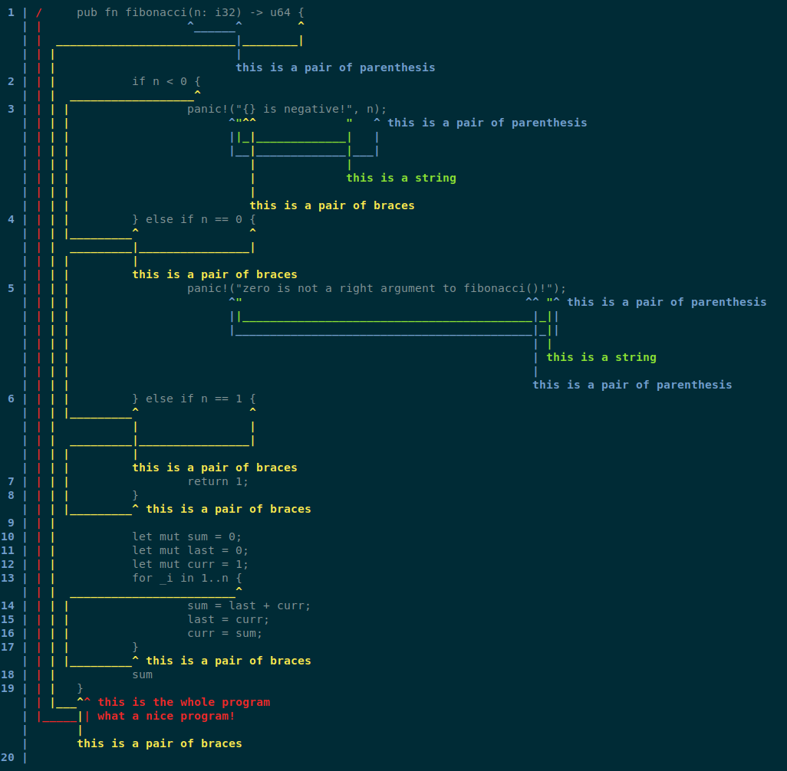

# Source Span

<table><tr>
  <td><a href="https://docs.rs/source-span">Documentation</a></td>
  <td><a href="https://crates.io/crates/source-span">Crate informations</a></td>
  <td><a href="https://github.com/timothee-haudebourg/source-span">Repository</a></td>
</tr></table>

This crate provides utilities to locate characters and ranges of characters
(spans) in a source file. It also provides ways to print fragments of the source
file with span informations, hints, errors, warning and notes,
just like the `rustc` compiler.

## Basic usage

This crate is designed as an incremental parsing utility.
Its primary function is to keep track of the line and column position of each character
in a character stream:
```rust
use source_span::Position;

let metrics = &source_span::DEFAULT_METRICS; // characters metrics
let mut pos = Position::new(0, 0);
let str = "Hello\nWorld!";

for c in str.chars() {
	// `pos` holds the position (line, column) of
	// the current character at all points.
	pos.shift(c, metrics)
}
```

Using the `Span` type, it is also possible to build ranges of characters.

```rust
let mut chars = "1 + (2 * 2) / 3".chars();
let mut pos = Position::new(0, 0);
while let Some(c) = chars.next() {
	if c == '(' {
		break
	}

	pos.shift(c, &metrics)
}

let mut span: Span = pos.into();

while let Some(c) = chars.next() {
	span.push(c, &metrics);

	if c == ')' {
		break
	}
}

// `span` now holds the beginning and end position of the `"(2 * 2)"` slice.
```
## SourceBuffer

This crate provides a simple `SourceBuffer` buffer
to index a character stream by character position.

```rust
use std::fs::File;
use source_span::{DEFAULT_METRICS, Position, SourceBuffer};

let file = File::open("examples/fib.txt")?;
let chars = utf8_decode::UnsafeDecoder::new(file.bytes());
let metrics = DEFAULT_METRICS;
let buffer = SourceBuffer::new(chars, Position::default(), metrics);

buffer.at(Position::new(4, 2)).unwrap()? // get the character at line 4, column 2.
```

The `SourceBuffer` type works as a wrapper around a character iterator.
It is lazy: new characters are pulled from the wrapped iterator and put in the
buffer only when needed.
It can be used to access characters at a specific cursor position (as seen above)
or iterate a slice of the text using a `Span`:

```rust
for c in buffer.iter_span(span) {
	// do something
}
```

## Formatting

This crate also provides a way to format decorated text, highlighting portions
of the source text using ASCII art.
It can be used to produce outputs similar as the following:



Each highlight is described by a span, can be associated to a label and
drawn with a specific style (defining what characters and color to use to draw
the lines).

## License

Licensed under either of

 * Apache License, Version 2.0 ([LICENSE-APACHE](LICENSE-APACHE) or http://www.apache.org/licenses/LICENSE-2.0)
 * MIT license ([LICENSE-MIT](LICENSE-MIT) or http://opensource.org/licenses/MIT)

at your option.

### Contribution

Unless you explicitly state otherwise, any contribution intentionally submitted
for inclusion in the work by you, as defined in the Apache-2.0 license, shall be dual licensed as above, without any
additional terms or conditions.
